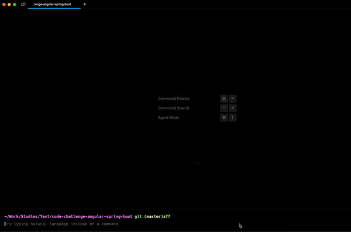

### CRUD with Angular 17 and Java17 / Spring Boot 3.3.1
This is the root folder for both projects. Enter each project to see their respective configurations.

#### Run frontend and backend together using Docker Compose.
```
docker-compose build 
```

```
docker-compose up
```



#### Spring Boot will use port `8080` and Angular will use port`8081`.

frontend `http://localhost:8081/user`

backend `http://localhost:8080/swagger-ui/index.html`

h2 console `http://localhost:8080/h2/login.jsp`

