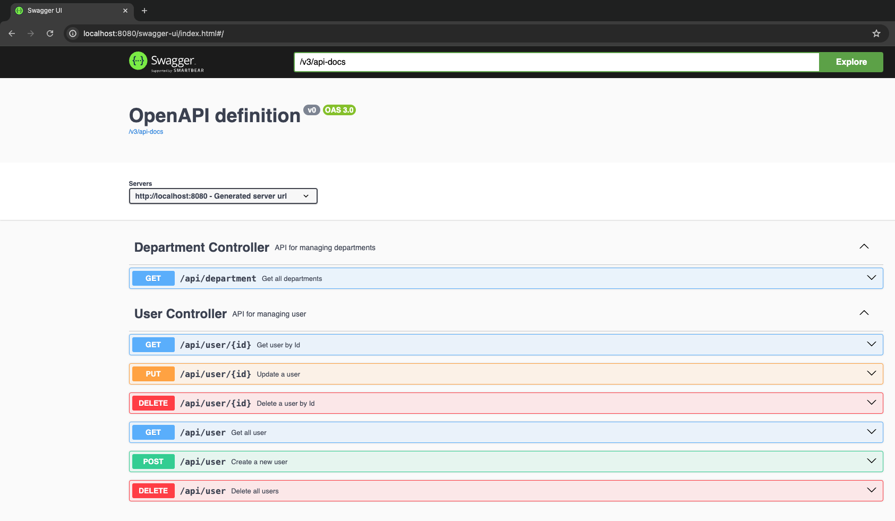
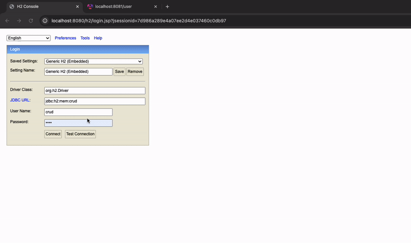
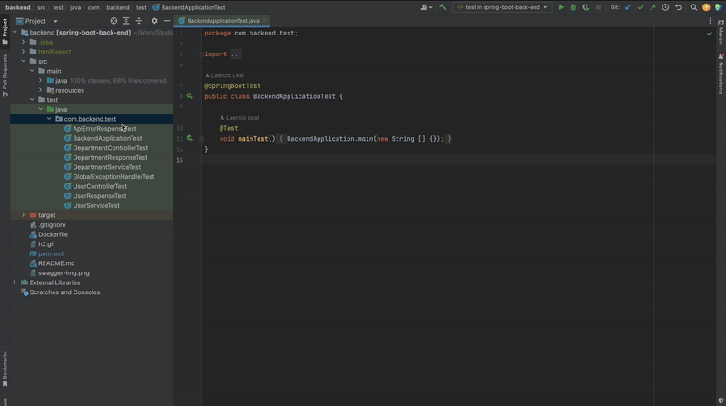

## Spring Boot Application

Backend CRUD (Create, Read, Update, Delete) application that manages users and their associated departments. It is developed in Java 17 and the Spring Framework.

### Dependencies
- `spring-boot-starter`: The main starter that includes support for auto-configuration, logging, and YAML configuration.
- `spring-boot-starter-web`: Builds web applications, including RESTful services, using Spring MVC. It uses Tomcat as the default embedded container.
- `spring-boot-starter-data-jpa`: Provides JPA and Spring Data JPA support for the application.
- `spring-boot-starter-test`: Provides testing libraries, including JUnit and Mockito.

### Database and ORM
- `H2 Database`: A lightweight, embedded database perfect for development and testing.
- `Liquibase`: A database schema change management library that helps track, version, and deploy database changes.

### API Documentation
- `swagger-annotations`: Annotations for documenting your API in a machine-readable format.
- `springdoc-openapi-starter-webmvc-ui`: Integrates OpenAPI 3 with Spring Boot to generate interactive API documentation.

### Utility Libraries
- `Lombok`: A library that helps reduce boilerplate code by generating getters, setters, and other common methods at compile time.
- `jackson-datatype-jdk8`: Support for Java 8 data types in Jackson.

### Application using Java 17 and Spring Framework
This project is a comprehensive CRUD (Create, Read, Update, Delete) application built with Angular 17 for the frontend and Java with the Spring Framework for the backend. It demonstrates how to consume REST APIs, display data, and perform various operations on user data.

### Features

- **User Management**: Each user has an ID, first name, last name, and department.
- **Search Functionality**: A search bar to find users by name.

### Running only the backend, if desired
```bash mvn spring-boot:run```

### Swagger
Access the URL: `http://localhost:8080/swagger-ui/index.html`



#### Access H2 Database Console
H2 console `http://localhost:8080/h2/login.jsp`

#### GIF H2


### Running Tests
`mvn clean test`

Another way to run tests is by using IntelliJ and viewing test coverage.




