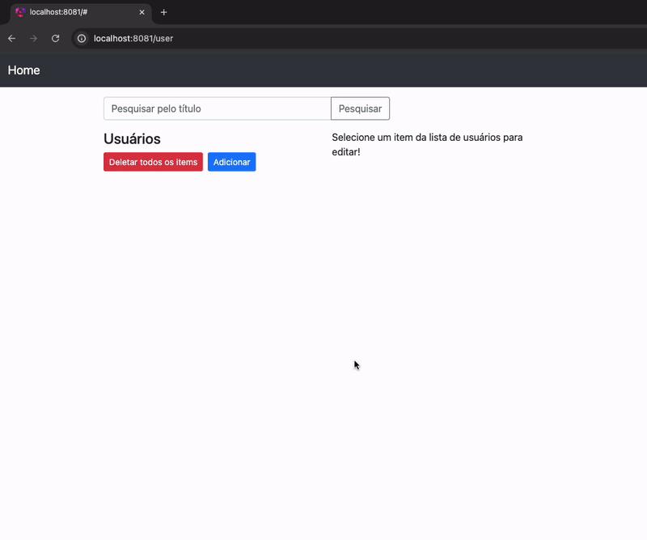

### Aplicação CRUD com Angular e Java Spring Framework
Este projeto é uma aplicação CRUD (Criar, Ler, Atualizar, Excluir) abrangente construída com Angular 17 para o frontend e Java com o Spring Framework para o backend.
Ele demonstra como consumir APIs REST, exibir dados e realizar várias operações em dados de usuários.

### Funcionalidades

- Gestão de Usuários: Cada usuário tem um Id, nome, sobrenome e departamento.
- Funcionalidade de Busca: Uma barra de pesquisa para encontrar usuários pelo nome.

Crie um exemplo de aplicativo CRUD com Angular 17 para consumir APIs REST, exibir, modificar e buscar dados de Usuários.

### Executar apenas o frontend, caso deseje
> Run `ng serve --port 8081` to run without docker-compose.yml. Navigate to `http://localhost:8081/user`.

 

#### CRUD em gif

